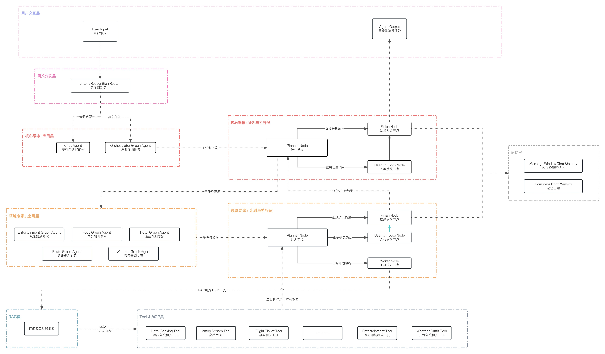

# Agentic-Travel-Hub 🐱

> **从零设计，亲手将 `while-if-else` 迭代至两层 Graph 嵌套的架构演进项目，用于 Java AI Agent 旅行规划引擎。**

[](https://openjdk.org/projects/jdk/21/)
[](https://spring.io/projects/spring-boot)
[](https://spring.io/projects/spring-ai)
[](https://sca.aliyun.com)

---

## 项目概述

基于 Spring AI 生态，从零构建了一个支持多 Agent 协作的旅行规划系统。系统拥有 **126 个 @Tool 方法**（对接高德地图真实
API），覆盖 **出行路线、餐饮美食、酒店住宿、景点娱乐、天气穿搭** 五大领域。用户输入自然语言需求后，Agent
自主拆解任务、调度领域专家、调用工具、汇总方案。

**核心价值不仅在"能跑"，还在于经历了四个架构版本的完整迭代**，每个版本都有明确的优化目标和可量化的收益。

---

## 架构演进

```
v0 ─────────────→ v1 ───────────────→ v2 ─────────────→ v3 ──────────────────→ v4（下一迭代版本计划）
while-if-else     手写状态机            多Agent+while     多Agent+Graph嵌套         接入MySQL记录全局聊天记录，用户已完成的推荐计划，待完成计划等
单Agent            单Agent             编排者+多专家       两层Graph                 接入PG vector，完善个人标签，个人偏好，反馈回流权重动态变更等
双模型分离          手写Graph思路         模板方法模式        Ali Graph + 记忆压缩      接入 Prometheus + Grafana，监控每轮 ReAct 耗时、Tool 调用成功率、Token 消耗趋势
```

### v0 · ReAct 引擎

双模型编排：**DeepSeek** 负责规划，**Qwen** 负责执行。通过 RAG 从知识库检索工具，手写 `while` 循环驱动 ReAct 流程。

**解决**：从零搭建了可运行的 Agent 骨架，验证了双模型分工的可行性。

**遗留**：上下文线性膨胀；`if-else` 控制流僵硬。

### v1 · Graph 状态机

引入 State/Node/Edge 三要素，将 while 循环中的逻辑拆解为独立节点和条件边，提升代码可读性。

**解决**：状态控制流从"散落的 if-else"升级为"结构化的节点和边"。

**遗留**：本质上仍是手写 while + if-else；上下文膨胀问题未解决。

### v2 · 多 Agent 编排

将 82 个 Tool 按领域拆分为 5 个子 Agent（RouteAgent / FoodAgent / HotelAgent / EntertainmentAgent / WeatherAgent）。编排者只看到
5 行 Agent 描述，每个子 Agent 只管理自己的 15-20 个 Tool。

**解决**：单Agent架构升级为多Agent架构；Agent实现动态注册，相关prompt也实现动态修改，无需硬编码

**遗留**：编排者和子 Agent 内部仍是 while 循环；上下文膨胀依然存在。

### v3 · 两层 Graph 嵌套

使用 **Spring AI Alibaba Graph** 彻底替换所有 while 循环。编排者是一张 Graph，每个子 Agent 内部也是一张 Graph。子 Agent
的微观推理过程不计入短期记忆，只在产出最终结论时才写入。引入语义记忆压缩（消息超过 10 条自动 LLM 压缩为摘要）。

**解决**：上下文膨胀（语义压缩 + 子图内部不泄露）；控制流彻底声明化。

**可优化点**：1、接入MySQL记录全局聊天记录，用户已完成的推荐计划，待完成计划等；2、接入PG vector，完善个人标签，个人偏好，反馈回流权重动态变更等；3、接入 Prometheus + Grafana，监控每轮 ReAct 耗时、Tool 调用成功率、Token 消耗趋势

---

## 最新封版：v3架构图



---

## 技术亮点

| 特性                       | 说明                                                                 |
|--------------------------|--------------------------------------------------------------------|
| **多 Agent 分层架构**         | 编排者 + 5 领域专家，Token 消耗降低 90%+                                       |
| **多层 Graph 嵌套**          | 基于 Spring AI Alibaba StateGraph，亲图和子图独立编译                          |
| **语义记忆压缩**               | 对话超过 10 条自动触发 LLM 压缩，Planner 上下文永不膨胀                               |
| **Tool RAG**             | 基于百炼云资料库检索，避免将200+Tool一次放入的Token消耗                                 |
| **Prompt 契约绑定**          | `@PromptField` 注解 + `PromptBuilder` 动态生成 SystemPrompt，改实体不改 Prompt |
| **126 个 @Tool 方法**       | 后置ToolRAG，避免一次挂载100+Tool带来的Token消耗                                 |
| **SSE 流式输出**             | `graph.stream()` 原生 Flux，每个节点执行完自动推送进度事件                           |
| **recursionLimit 源码级踩坑** | 反编译 Spring AI Alibaba Graph Core 定位静默截停问题                          |

---

## 项目结构

```
Agentic-Travel-Hub/
├── hub-starter/          # 启动入口 + Controller + 前端页面
├── hub-aiagent/          # Agent 引擎核心
│   └── src/main/java/com/travel/aiagent/
│       ├── v0/           # ReAct: while-if-else + 双模型分离
│       ├── v1/           # Graph: 手写状态机 State/Node/Edge
│       ├── v2/           # 多Agent: 编排者 + 5领域专家 + while
│       ├── v3/           # Graph+多Agent: Ali Graph + 记忆压缩 + 图嵌套
│       ├── ai版/         # AI 参考实现（声明式 StateGraph 引擎）
│       ├── common/       # 共享基础设施（Planner/Worker/Memory/Router）
│       └── 设计文档/     # 设计思路 + 流程设计图
├── hub-tools/            # 126 个 @Tool 方法 + 高德 MapApiClient
├── hub-common/           # 公共枚举/常量/异常
└── frontend/             # 前端控制台
```

---

## 快速开始

```bash
# 环境要求: Java 21, Maven 3.8+

# 1. 配置 API Key
# 编辑 hub-starter/src/main/resources/application-dev.yml
#   spring.ai.dashscope.api-key: sk-your-key
#   spring.ai.openai.api-key: sk-your-deepseek-key
#   amap.maps.api-key: your-amap-key

# 2. 启动
cd hub-starter
mvn spring-boot:run

# 3. 打开前端
# 浏览器打开 frontend/index.html
# 或访问 http://localhost:8080/api/aiagent/chat/stream/v3

# 4. 切换版本
# 前端左上角 4 个卡片分别对应 v0/v1/v2/v3，点击切换
# 或直接调不同 endpoint:
#   /api/aiagent/chat/stream/v0
#   /api/aiagent/chat/stream/v1
#   /api/aiagent/chat/stream/v2
#   /api/aiagent/chat/stream/v3
```

---

## 设计文档

每个版本的详细设计思路、流程拓扑图、组件设计顺序、已解决问题和遗留问题：

- [v0 · while-if-else 手搓 ReAct](hub-aiagent/设计文档/设计思路/设计思路_v0_ReAct.md)
- [v1 · 手写有向图雏形](hub-aiagent/设计文档/设计思路/设计思路_v1_Graph形式ReAct.md)
- [v2 · 多Agent 嵌套](hub-aiagent/设计文档/设计思路/设计思路_v2_多AgentReAct.md)
- [v3 · Graph 形式多 Agent](hub-aiagent/设计文档/设计思路/设计思路_v3_Graph形式多AgentReAct.md)

---

## License

MIT
