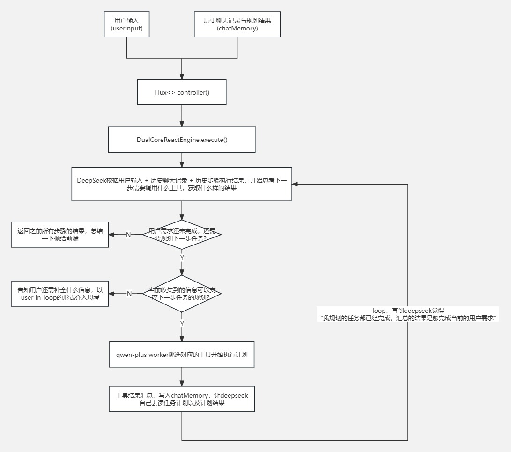

# 🗺️ v0：while搭配if-else手搓ReAct

---

## 🎯 阶段目标
摆脱传统AI一问一答的形式，基于 Spring AI 生态，在 Java 后端通过手写状态控制流，驱动大模型自主实现 **Reason-Act-Observe（思考-行动-观察）** 的标准 ReAct 工作流。

---

## 🏗️ 设计思路

### 1. 明确ReAct定义：
* **思考（Reasoning）**：分析当前用户输入与历史执行日志，动态拆解任务，决定下一步该做什么（Tool_Call、Clarify 还是 Finish）。
* **行动（Acting）**：根据规划逻辑，真实触发底层工具调用（如 RAG 知识库检索与调用）、或直接向前端吐出最终答案，或让用户补全信息方便思考(user-in-loop)。
* **观察（Observation）**：完整接收并脱水工具执行的真实客观结果，作为事实（Fact）注入下一轮决策流。
* **迭代（Loop）**：基于观察结果继续进行下一次“思考-行动-观察”闭环，直到任务终结。
* **参考文档**：https://java2ai.com/docs/frameworks/agent-framework/tutorials/agents

### 2. 双模型编排（Dual-Core Orchestration）
为了追求极致的性价比与稳定性，采用**“双模型编排”**方式：
* **大脑（Planner）**：由 **DeepSeek-v4-pro** 担当，利用其强悍的逻辑推理与长文本拆解能力，专注于任务的宏观规划与下一步 Action 预测（关键是五月还打折，巨便宜）。
* **四肢（Worker）**：由 **qwen-plus** 担当，利用其稳健的工具调用能力，专注于去底层执行各种原子Tool（关键是百炼云送3个月的免费模型试用量，每个模型送100wToken，不花钱）。

### 3. 主体功能流程拓扑
```
前端发起请求 ➔ Controller (Flux 流式接收) 
                 ➔ DeepSeek 思考 (任务拆解) 
                 ➔ Qwen 执行 Tool (RAG 知识库检索与调用) 
                 ➔ 结果回流 ➔ (大循环 Loop) ➔ 最终结果 WebFlux 返回
```

---

## 📊 核心流程设计图
下图完整绘制了v0版本中，执行任务时的分支与边界：



---

## 🛠️ 基于主流程，从下至上的组件与类设计

###  第一步：基础设施初始化 —— `ChatClientConfig`
因为需要两个模型来完成工作，所以先做好模型的底层 configuration，在 Spring Boot 启动时自动初始化好。

### 🧠 第二步：宏观规划引擎 —— `DeepSeekPlannerService`
chatClient 配置好后，此时启动可以拿到 chatClient 的对应 Bean 了，考虑到接口调用的第一步是做任务拆分，需要和 deepseek 大模型通话，所以开始处理 deepseek 任务拆分逻辑。

### 🛠️ 第三步：原子执行器 —— `QwenWorkerService`
当deepseek 的 plan() 执行完后，获得 PlanDetailVO，将 PlanDetailVO 作为入参，call 通义千问大模型，让通义千问根据计划，访问阿里云百炼知识库，找到 Top5 功能描述相近的工具列表，让通义千问决定调哪个工具来执行当前计划步骤。

### ⚙️ 第四步：控制状态机 —— `DualCoreReactEngine`
整个 v0 系统的控制流中枢。内部通过硬编码 `while (currentLoopTimes <= maxLoopTimes)` 维护状态转移计数。
* **防御式边界**：设定最大轮次上限（maxLoopTimes），防止大模型因逻辑幻觉陷入无休止的自我调用黑洞。
* **进度透传**：通过 `Consumer<String> progressListener` 函数式接口，将大模型的每一步 `thought` 与工具执行结果实时流式（Stream）推给前端。

### 💾 第五步：会话持久化控制 —— `LongTermMemory` 与 `ShortTermMemory`
为了防止系统由于断流导致上下文丢失，引入双层记忆体：
* **长期记忆**：持久化写入数据库，用于未来的跨会话召回。（暂时懒得加入数据库存储）
* **短期记忆**：依托内存维护 `chatMemory` 运行时上下文，串联当前会话的多轮推理足迹。

### 🛡️ 第六步：上下文防抖机制 —— `AgentMemoryConfig`
考虑到纯手工 ReAct 引擎在多轮循环后会导致上下文呈几何级数膨胀，在 Spring 启动时自动注入滑动窗口（Sliding Window）拦截配置，强制抛弃过期的老旧对话数据，缓解大模型的上下文装载压力，以及节省Token消耗。

---

## 🚨 本版本核心痛点

### 待解决的问题：
1. **上下文暴涨**：采用最原始的字符串硬累加方式串联记忆。大模型每一轮生成的“思考废话”被原封不动地带入下一轮，不仅Token 烧得极快，而且推理的时间也随着轮次逐步增加，上下文过长时还会出现幻觉。
2. **状态控制流僵硬**：使用纯手写 `while` 和 `if-else` 控制转移，想要新增一个节点就得新搓一个if-else；如果想在子分支中加入其他逻辑，就得在if-else里嵌套if-else。

---