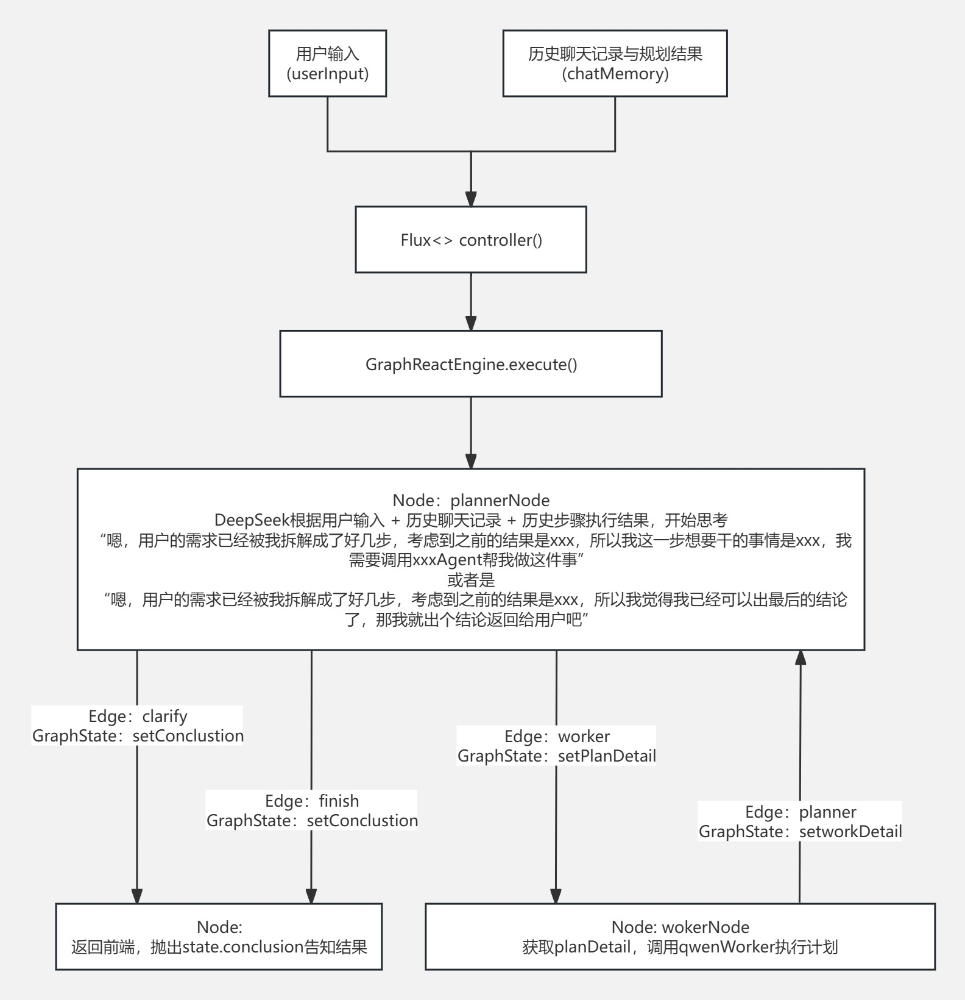

# 🗺️ v1：基于v0“while-if-else”的手搓有向图雏形（Graph）版本

---

## 🎯 阶段目标
针对 v0 版本中单体引擎逻辑臃肿、代码高度耦合的痛点，初步引入状态机与有向无环图（DAG）的设计思想。将原本混杂在同一个 `while` 循环中的“规划、执行、反思”逻辑拆解为独立的组件，实现**业务逻辑节点（Nodes）**与**条件路由边界（Edges）**的初步分离。

---

## 🏗️ 设计思路

### 1. 明确Graph三要素：
* **公文包（State）**：共享的数据结构，表示应用程序的当前快照。
* **边（Edges）**：定义了逻辑如何路由以及图如何决定停止。
* * **节点（Nodes）**：实现具体的数据使用逻辑，以及决定下一步去到的条件边
* **参考文档**：https://java2ai.com/docs/frameworks/graph-core/core/core-library

### 2. 利用图解耦
不再让主入口用if-else去堆砌逻辑，而是将系统的生命周期抽象为若干个标准的**图节点（Nodes）**。系统当前的需要去到的节点统一由边（Edges）和公文包中的状态（States）决定。

### 3. 主体功能流程拓扑
```
前端发起请求 ➔ 初始化 GraphState 上下文
                 ➔ 进入驱动引擎主循环 ➔ Edge 动态计算下一跳节点名称
                 ➔ 路由命中：PlannerNode (DeepSeek 规划) ➔ 刷新 State 
                 ➔ 路由命中：WorkerNode (Qwen 执行 Tool) ➔ 刷新 State
                 ➔ 路由命中：MemoryPruneNode (记忆裁切) ➔ 流程终结并抛出结果
```

---

## 📊 核心流程设计图
下图展示了 v1 版本中，手工构建的“伪图架构”流转逻辑：



---

## 🛠️ 基于主流程，从下至上的组件与类设计

### 💼 第一步：全局公文包 —— `GraphStateVO`
要设计Node，就需要先设计Edge流转方向；要设计Edge流转方向，就需要先设计一个共享的公文包装载当前node的输入与输出。所以先创建一个公文包类，让任务随着 Node -> Edge -> State -> Edge -> Node流转时带着走

### 🗺️ 第二步：动态条件路由器 —— `GraphEdge`
设计Edge，决定任务状态流转方向

### ⚙️ 第三步：有向图逻辑节点群 —— `GraphNodes`
Edge与State设计完成后，开始定义不同的Edge上，Node分别该干些做什么事

### 🚀 第四步：图流转状态引擎 —— `GraphReactEngine`
创建service类，接入controller，接受输入信息，完成 userinput -> node -> edge -> node -> loop -> return的流转流程

---

## 🚨 本版本核心痛点与历史版本问题解决

### 已解决的问题：
1. **状态控制流僵硬**：解决了v0中if-else长且丑陋的观感问题.

### 待解决的问题：
1. **换汤不换药的运行分支控制**：由于缺乏底层图框架的支撑，引擎本质上还是在用 `while` 内部套一堆 `if (nodeName.equals(...))` 的硬编码方式在手工拨动状态指针。节点无法实现真正的解耦插拔，图的流转控制权依然死死锁在主引擎类中。
2. **上下文暴涨**：采用最原始的字符串硬累加方式串联记忆。大模型每一轮生成的“思考废话”被原封不动地带入下一轮，不仅Token 烧得极快，而且推理的时间也随着轮次逐步增加，上下文过长时还会出现幻觉。

---