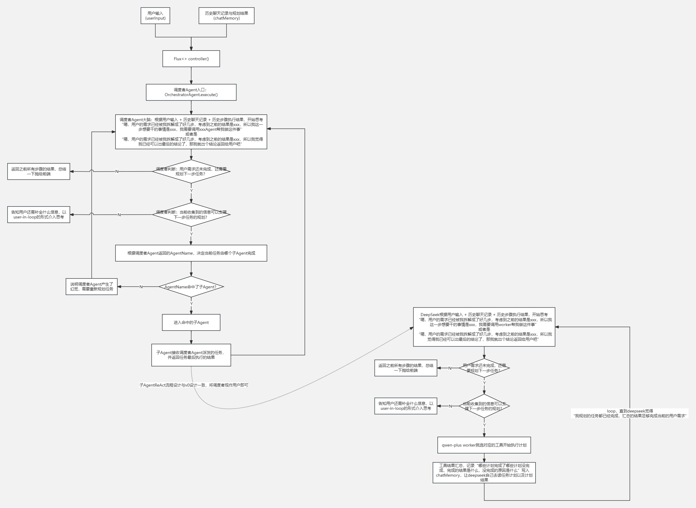

# 🗺️ v2：基于v0“单Agent多Tool”升级来的多Agent嵌套版本

---

## 🎯 阶段目标
考虑到实际环境中，相较于“由一个worker去管理500个工具，不停去扩容工具库”的场景，更加可能出现的管理形式是，“我现在有衣、食、住、行四类Agent，后期会再新增酒店预订，机票预订的Agent。
这些Agent我可以接入进来，也可以单独拎出去用”。所以基于v0的“单Agent-多Tool”模式，升级成“多Agent-多Tool”模式

---

## 🏗️ 顶层设计思路

### 1. 职责分离与专家分治
系统不再依赖单一的通用 Planner 去包揽全局 Tool 的调度。而是根据业务边界，将天气、美食、住宿、出行和娱乐拆解为 5 个天然隔离的“局部自治”子智能体。
* **中央调度层（Orchestrator）**：只负责将用户的原始宏观意图拆解为单步子任务，并指派给对应领域的智能体。
* **垂直执行层（Sub-Agents）**：在各自的一亩三分地里，独立进行属于自己的，由中央调度层派发任务的微观 ReAct 局部推理与工具调用。

### 2. 动态注册机制
为了杜绝在调度中枢硬编码Sub-Agents导致的“扩展性灾难”，引入面向接口编程的设计范式。通过将子智能体列表序列化为 JSON Schema 注入 System Prompt，实现子智能体的**即插即用**。

### 3. 主体功能流程拓扑
```
前端请求 ➔ OrchestratorAgent 入口
            ➔ DeepSeek 总调度规划 ➔ 命中 SUB_AGENT_CALL 决策
            ➔ 路由动态分发 ➔ 命中特定 Sub-Agent（如 FoodAgent）
            ➔ Sub-Agent 内部启动微观局部 ReAct ➔ Qwen 并发/串行调用原子 Tool
            ➔ 子任务结论回流 ➔ 刷新 Orchestrator 上下文 ➔ 推动下一步大循环
```

---

## 📊 核心业务流设计图
下图展示了v2版本中，“调度者call子Agent”的流转逻辑：



---

## 🛠️ 基于主流程，从下至上的组件与类设计

### 🧩 第一步：拆分领域专家
根据业务 Tool 的职能分类，强行切分出 5 个高内聚的专家类：
* `WeatherAgent`：天气穿搭专家，掌管实时天气与叠穿指数。
* `FoodAgent`：美食探索专家，掌管附近餐厅与深夜食堂。
* `HotelAgent`：酒店住宿专家，掌管周边设施与接送服务。
* `RouteAgent`：出行路线专家，掌管网约车估价与多模态路径规划。
* `EntertainmentAgent`：景点娱乐专家，掌管博物馆预约与演出影讯。

### 🔌 第二步：面向对象抽象协议 —— `ITravelAgent`
不想在调度者Agent的路由和prompt中写死存在的子Agent，所以共同实现一个interface，在调度者中获取interface的实现类List，json化进prompt和Map，就可实现动态注册Agent。
且此方式可以保证注册的Agent实例与prompt一致，不会出现Map注册的是A,B,C实例，prompt写的是A,C,D实例的问题。

### 🎨 第三步：复用与模板方法模式 —— `BaseTravelAgent`
不想每个子Agent都复制粘贴一遍execute()方法，所以定义一个BaseAgent统一实现，走模板设计模式，其余的子Agent继承BaseAgent即可。

### 👑 第四步：多智能体总调度中枢 —— `OrchestratorAgent`
系统的最高指挥官。利用 Spring 的依赖注入自动收集所有的 `BaseTravelAgent` 实例，构建起 `subAgentNameAndAgentMap` 动态发现表。它拿着 `SystemPrompt.buildOrchestratorSystemPrompt` 的总控指令，驱使 DeepSeek 实施高级别的指派流。

---

## 🚨 本版本核心痛点与历史版本问题解决

### 已解决的问题：
1. **拓展性延伸**：采用多Agent嵌套的模式，支持子Agent独立工作，同时也支持子Agent加入调度者Agent完成复杂任务编排。

### 待解决的问题：
1. **上下文暴涨**：采用最原始的字符串硬累加方式串联记忆。大模型每一轮生成的“思考废话”被原封不动地带入下一轮，不仅Token 烧得极快，而且推理的时间也随着轮次逐步增加，上下文过长时还会出现幻觉。尤其是在v0的基础上，加入了子Agent的思考和总结。
2. **状态控制流僵硬**：使用纯手写 `while` 和 `if-else` 控制转移，想要新增一个节点就得新搓一个if-else；如果想在子分支中加入其他逻辑，就得在if-else里嵌套if-else。尤其是在v0的基础上，还加入了调度者Agent和子Agent的角色，if-else更多了。

---