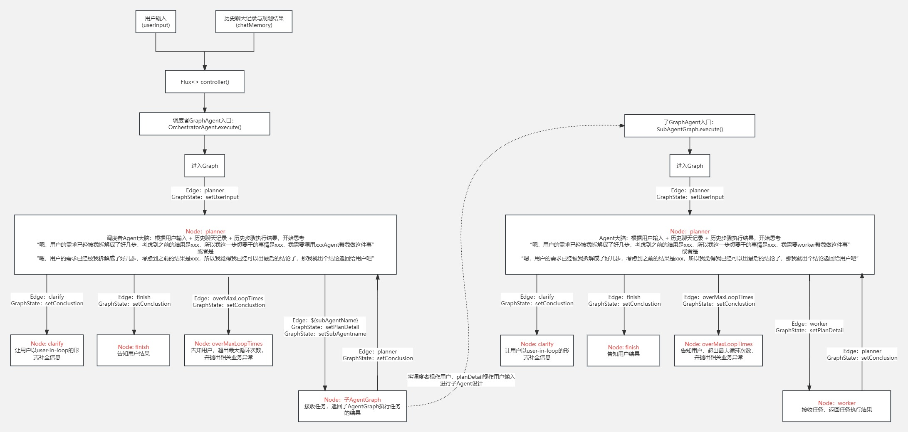

# 🗺️ v3：基于v1与v2，使用Spring AI Alibaba的Graph完成多Agent+图嵌套版本

---

## 🎯 阶段目标
基于v1的Graph认知，使用标准的Ali Graph全面重构v2中的手工硬编码 `while-if-else`的硬编码，并采取记忆压缩与重构chatMemory append流程，彻底减少Token消耗。

---

## 🏗️ 顶层架构核心设计思路

### 1. 多阶层图物理隔离
将v1中的“单Agent-多Tool”架构，转变成“调度者Agent-子Agent”双层嵌套图架构：
* **总调度亲图（OrchestratorGraph）**：以 **DeepSeek** 为核心大脑，只负责解析用户的全局宏观意图，动态将子任务指派给各注册中心内的专家节点，不直接参与具体的工具调用。
* **垂直专家子图（SubAgentGraph）**：以 **DeepSeek** 为核心大脑，**通义千问（Qwen）** 为执行四肢，独立负责局部小范围内的 ReAct 推理。

### 2. ChatMemory优化
子Agent内部在与工具交互、自我反思时会产生大量长篇大论的“思考噪音”。所以ChatMemory改为：只有当子图完全执行完微观ReAct，拿到最终结论后，才写入ChatMemory。其余所有微观推演流程的输入输出只记录在子图内部的 `GraphState` 局部变量中。

### 3. 全链路运行时拓扑
```
前端请求 ➔ OrchestratorGraphAgent 异步接收
            ➔ 亲图（OrchestratorGraph）启动 ➔ DeepSeekPlannerNode 任务拆解
            ➔ 条件路由边（Edge）计算 ➔ 分发至动态绑定专家节点（子图入参注入）
            ➔ 子图（SubAgentGraph）自旋 ➔ 线程池并发执行 RAG 原子工具
            ➔ 最终干货 Observation 提炼 ➔ ShortTermMemory 刷新 ➔ 亲图下一轮循环
```

---

## 📊 核心业务流设计图
下图展示了v3版本中，图嵌套的流转逻辑：



---

## 🛠️ 基于主流程，从下至上的组件与类设计

### 🔌 1. 动态服务发现中心 —— `InitComponet`
spring启动时动态构建Map<subAgentName,subAgent>注册表。后续新增专家领域只需新增一个注入类，调度者图可以实现无感知自动挂载扩展。

### 🗺️ 2. 子图三大件与启动器 - `SubAgentGraphNode` & `SubAgentGraphEdge` & `SubAgentGraph` & `BaseTravelGraphAgent`
参考v1的设计思路，完成子图中 edge -> node -> edge -> ···loop··· -> 出口的编排

### 🗺️ 3. 亲图三大件与启动器 - `OrchestratorGraphNode` & `OrchestratorGraphEdge`  & `OrchestratorGraph` & `OrchestratorGraphAgent`
参考v1的设计思路，完成亲图中 edge -> node -> edge -> ···loop··· -> 出口的编排

### 💾 4. 语义记忆智能脱水 —— `ShortTermMemory`
针对长对话历史的上下文降熵中枢。当 ChatMemory 消息计数触发 `COMPRESS_THRESHOLD = 10` 的阈值时，自动调用高吞吐模型进行异步语义级压缩，剔除废话，只保留“目的地、天数、预算、已确定的 Observation 的结构化骨干”，将老旧长记忆压缩回 1 条高浓度摘要，彻底规避了大模型的长文本健忘症。

---

## 🚨 本版本核心痛点与历史版本问题解决

### 已解决的问题：
1. **上下文暴涨**：子Agent中的微观ReAct流程不计入ChatMemory，通过StateMap在内部流转，只有子Agent认为自己可以产出结论了的那一刻，才记录执行结果进入ChatMemory。并加入了ChatMemory记忆压缩流程，减少历史会话过多带来的上下文Token超长和LLM注意力漂移的问题。
2. **状态控制流僵硬**：使用Graph的Node与Edge共同控制流转节点，如果后期需要新增或修改处理流程，那么只需要在Graph.build时，针对node和edge做增改就好，不需要像以前一样以if-else的形式做硬编码。

### 待解决的问题：
1. **没有加入数据库做长期记忆**：暂时不考虑加入
2. **没有加入PG vector或外部知识库对文本产出做RAG**：阿里的百炼云的知识库的PG vector有点贵，也暂时不考虑

---